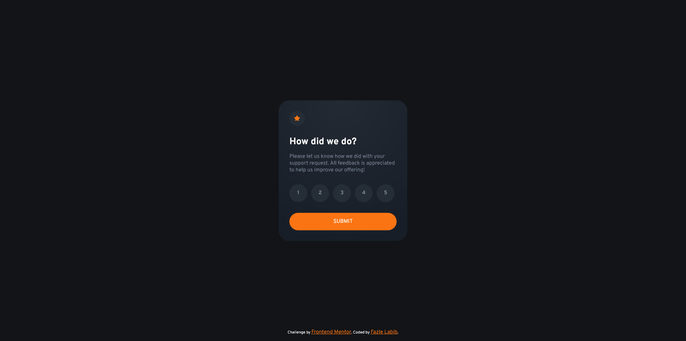
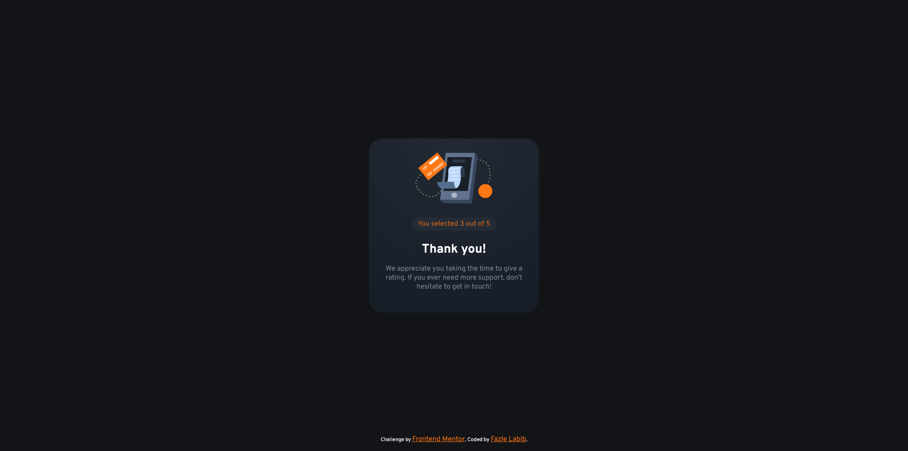
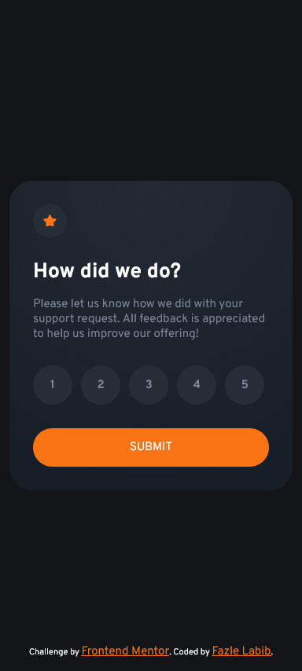

# Frontend Mentor - Interactive rating component solution

This is a solution to the [Interactive rating component challenge on Frontend Mentor](https://www.frontendmentor.io/challenges/interactive-rating-component-koxpeBUmI). Frontend Mentor challenges help you improve your coding skills by building realistic projects. 

## Table of contents

- [Overview](#overview)
  - [The challenge](#the-challenge)
  - [Screenshot](#screenshot)
  - [Links](#links)
- [My process](#my-process)
  - [Built with](#built-with)
  - [What I learned](#what-i-learned)
- [Author](#author)

## Overview

### The challenge

Users should be able to:

- View the optimal layout for the app depending on their device's screen size
- See hover states for all interactive elements on the page
- Select and submit a number rating
- See the "Thank you" card state after submitting a rating

### Screenshot





### Links

- Solution URL: [https://github.com/FazleLabib/frontend-mentor-interactive-rating-component](https://github.com/FazleLabib/frontend-mentor-interactive-rating-component)
- Live Site URL: [https://fazlelabib.github.io/frontend-mentor-interactive-rating-component](https://fazlelabib.github.io/frontend-mentor-interactive-rating-component)

## My process

### Built with

- Semantic HTML5 markup
- CSS custom properties
- Flexbox
- CSS Grid
- Mobile-first workflow
- Vanilla JavaScript


### What I learned

Learned a lot about manipulating DOM using JavaScript. I was also able to make the site more accessible by not just hiding the default radio inputs but by moving them out of the screen, so they still show up in screen-readers. Also figured out how to add animation to the submit button if no rating is selected and the button is clicked.

To see how you can add code snippets, see below:

<!-- ```html
<h1>Some HTML code I'm proud of</h1>
``` -->
```css
.hidden-radio {
    position: absolute;
    left: -9999px;
}

.shake {
    background-color: var(--orange);
    animation: shake 0.5s;
}
  
@keyframes shake {
    0% { transform: translateX(0); }
    25% { transform: translateX(-5px); }
    50% { transform: translateX(5px); }
    75% { transform: translateX(-5px); }
    100% { transform: translateX(5px); }
}
```
```js
const submitBtn = document.querySelector("#submit-btn");  
const inputs = document.querySelectorAll('input[name="rating"]');

submitBtn.addEventListener("click", (event) => {
    event.preventDefault();

    let rating;
    for (const input of inputs) {
        if (input.checked) {
            rating = input.value;
            break;
        }
    }

    if (!rating) {
        submitBtn.classList.add("shake");

        setTimeout(() => {
            submitBtn.classList.remove("shake");
        }, 500);

        return;
    }

    document.getElementById("rating-state").style.display = "none";
    document.getElementById("thank-you-state").style.display = "block";
    document.getElementById("obtained-rating").innerHTML = rating;

});
```

## Author

- Frontend Mentor - [@FazleLabib](https://www.frontendmentor.io/profile/FazleLabib)
